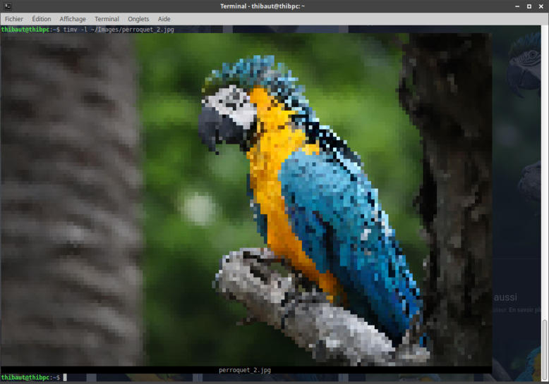

# timv :framed_picture:
[](https://opensource.org/licenses/gpl-3.0)

timv is a Terminal Image Viewer

## Install

```bash
wget https://github.com/ThiBsc/timv/blob/master/timv.py
mv timv.py /usr/local/bin/timv.py
```
Add to your `~/.bash_aliases` this line:
```txt
alias timv="python3 /usr/local/bin/timv.py"
```
Load your aliases:
```bash
source ~/.bash_aliases
```

## Use

```bash
timv [OPTION] images
 -l, --label	 Display file name
 -p, --percent	 Output percentage
Ex. timv -l -p 50 image.jpg
```
Here an sample output:

```bash
timv -l ~/Images/perroquet.jpg
```


